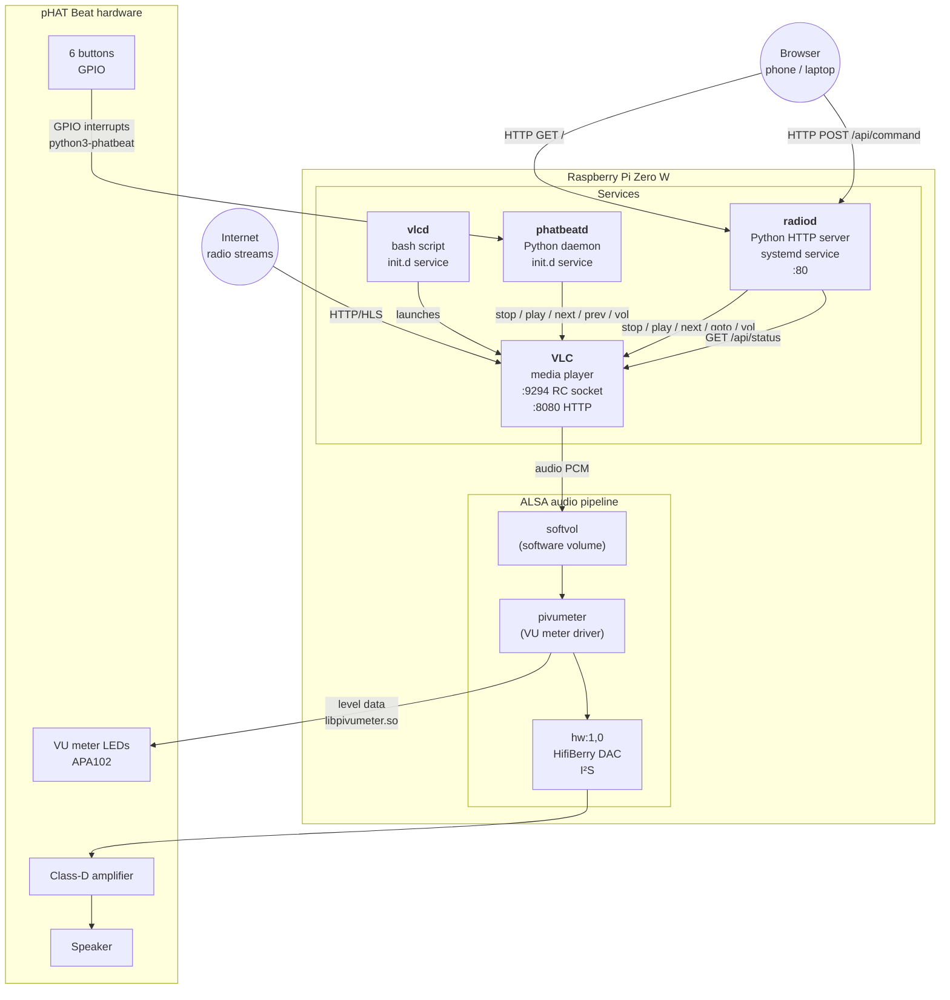
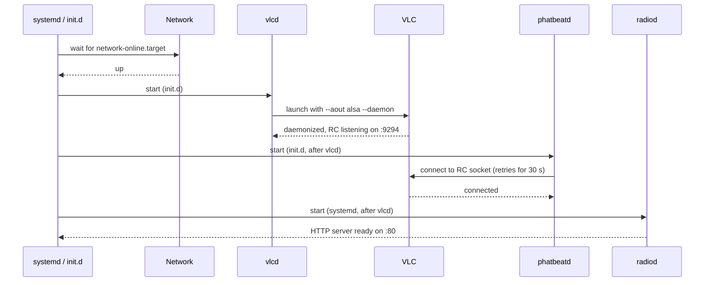

# Pirate Radio

Internet radio on a Raspberry Pi Zero W with a [pHAT Beat](https://shop.pimoroni.com/products/pirate-radio-pi-zero-w-project-kit) board.

## Hardware

- Raspberry Pi Zero W
- Pimoroni pHAT Beat (stereo DAC + amplifier + VU meter LEDs + 6 buttons)

Tested on **Raspbian Buster (Debian 10)**.

## Buttons

| Button | Action |
|--------|--------|
| Vol + / Vol − | Volume up / down |
| Play/Pause | Toggle playback |
| >> (Fast forward) | Next station |
| << (Rewind) | Previous station |
| Power | Shutdown the Pi |

## Playlist

Edit `playlist.m3u` (or `/home/pi/.config/vlc/playlist.m3u` on the Pi) to add or remove stations. Each entry is two lines:

```
#EXTINF:-1,Station Name
http://stream-url-here
```

The current playlist has 10 Italian stations:

1. Rai Radio 1
2. Rai Radio 2
3. Rai Radio 3
4. RTL 102.5
5. Radio 105
6. RDS 100% Grandi Successi
7. Virgin Radio Italia
8. Radio Monte Carlo
9. R101
10. Radio Kiss Kiss

> **Note:** Rai Radio 1 sometimes returns HTTP 403 depending on ISP/network. VLC will skip it automatically and start from Rai Radio 2.

## Install on a fresh Pi

```bash
git clone <this-repo> pirate-radio
cd pirate-radio
bash install.sh
sudo reboot
```

The `install.sh` script:
1. Installs `python3-phatbeat`, `vlc-bin`, `vlc-plugin-base`
2. Disables PulseAudio (it intercepts ALSA and prevents audio reaching the pHAT Beat)
3. Installs the ALSA config that routes audio through the pHAT Beat DAC and VU meter
4. Installs the `vlcd` and `phatbeatd` daemons and registers them as boot services
5. Copies the playlist

## Project structure

```
pirate-radio/
├── install.sh              — one-shot setup script
├── playlist.m3u            — Italian radio stations
├── config/
│   └── asound.conf         — ALSA routing: default → softvol → pivumeter → hw:1,0
├── bin/
│   ├── vlcd                — launches VLC as a headless daemon
│   └── phatbeatd           — listens to pHAT Beat buttons, controls VLC via RC socket
└── services/
    ├── vlcd                — init.d service (waits for network before starting)
    └── phatbeatd           — init.d service (waits for vlcd before starting)
```

## Architecture

There are four daemons running on the Pi. Two handle control (accepting commands), one fetches and decodes audio, and the ALSA stack handles the audio output pipeline.

### Services and control flow



### Boot sequence

Services start in dependency order. Each waits for the one before it.



### Audio pipeline detail

VLC outputs raw PCM to the ALSA `default` device, which is wired through three ALSA plugins before reaching the hardware:

```
VLC  →  softvol  →  pivumeter  →  hw:1,0 (HifiBerry DAC)
            │              │
         software       taps the
          volume        PCM data
          control       to drive
        (amixer PCM)    VU LEDs
```

`pivumeter` is an ALSA `meter` plugin (`libpivumeter.so`). It passes audio through unchanged while measuring peak levels and writing them to the pHAT Beat's APA102 LED strip over SPI — producing the VU meter animation.

### Web UI

`radiod` serves a single-page app from `www/index.html`. The page polls `/api/status` every 2 seconds and sends commands to `/api/command`. The backend translates UI station indices into VLC's internal playlist IDs (which start at 4, not 1) before forwarding to the RC socket.

```
Browser  ──POST /api/command {cmd:"goto 6"}──▶  radiod  ──goto 9──▶  VLC RC :9294
         ◀──GET  /api/status {state,volume,url}──        ◀──status────
```


## Logs

```bash
# VLC log
cat /var/run/vlcd/vlcd.log

# phatbeatd log
cat /var/log/phatbeatd.log
cat /var/log/phatbeatd.err

# Service status
sudo /etc/init.d/vlcd status
sudo /etc/init.d/phatbeatd status
```

## Manual control

VLC exposes an RC interface on port 9294. You can control it directly:

```bash
echo 'next'   | nc -q1 127.0.0.1 9294   # next station
echo 'prev'   | nc -q1 127.0.0.1 9294   # previous station
echo 'stop'   | nc -q1 127.0.0.1 9294   # stop (immediate silence)
echo 'play'   | nc -q1 127.0.0.1 9294   # resume (reconnects to current station)
echo 'status' | nc -q1 127.0.0.1 9294   # show current state
echo 'volume 256' | nc -q1 127.0.0.1 9294  # set volume (0–1024, 512 = 100%)
```
